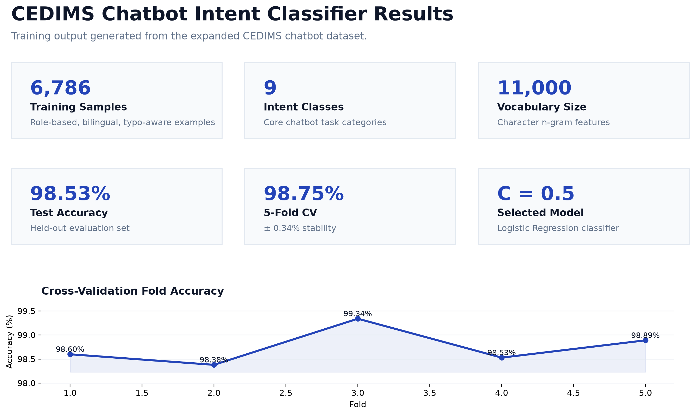
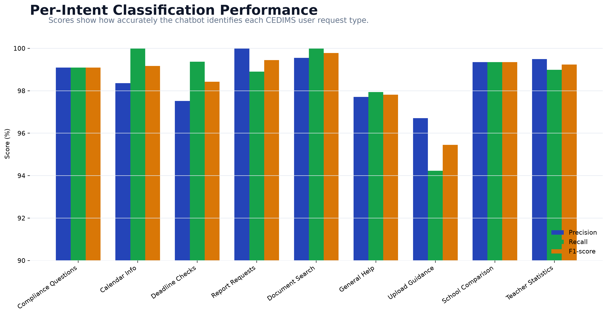
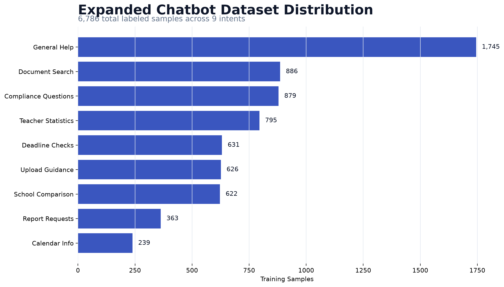
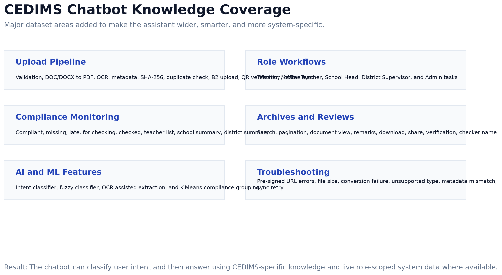

# CEDIMS Chatbot Training Results

Training date: September 23, 2026

## Purpose

The CEDIMS chatbot was expanded with a wider role-based and system-specific dataset so it can answer more practical questions about uploads, archives, compliance monitoring, deadlines, reviews, remarks, document search, and teacher statistics.

## Dataset Expansion

The training set now contains 6,786 labeled samples across 9 intents. The expanded data includes hand-written examples plus generated CEDIMS-specific phrasing, typo variants, English questions, and Tagalog/Filipino questions.

Intent distribution:

| Intent | Samples |
| --- | ---: |
| general_help | 1,745 |
| find_dll | 886 |
| ask_compliance | 879 |
| teacher_stats | 795 |
| check_deadline | 631 |
| how_to_upload | 626 |
| school_compare | 622 |
| create_report | 363 |
| calendar_info | 239 |

Additional knowledge areas added:

| Area | Coverage |
| --- | --- |
| Upload pipeline | File validation, DOC/DOCX to PDF conversion, OCR text extraction, metadata generation, SHA-256 hashing, duplicate detection, Backblaze B2 storage, QR verification, offline queue, and sync retry |
| Role workflows | Teacher, Master Teacher, School Head, District Supervisor, and Admin workflows |
| Document rules | DLL, ISP, ISR, subject, grade, quarter, week, due-date, and load matching |
| Compliance monitoring | Compliant, missing, late, for checking, checked, rate, teacher list, school summary, and district summary |
| Review and remarks | Checker remarks, view document, review action, remark visibility, and status changes |
| Archive handling | Search, pagination, document view, remarks, download, share, QR verification, and duplicate prevention |
| AI and ML features | Fuzzy classifier, intent classifier, OCR-assisted extraction, and K-Means compliance grouping |
| Troubleshooting | Pre-signed URL failures, conversion issues, unsupported file types, large files, upload sync problems, and metadata mismatch |

## Model Configuration

| Item | Value |
| --- | --- |
| Classifier | Logistic Regression |
| Features | Character n-grams |
| N-gram range | 2 to 5 characters |
| Vocabulary size | 11,000 |
| Selected C | 0.5 |
| Inner CV accuracy for selected C | 98.68% |
| Number of intents | 9 |

Character n-grams are useful for CEDIMS because users may type with misspellings, mixed English and Filipino terms, incomplete words, and varied phrasing.

## Training Metrics

| Metric | Result |
| --- | ---: |
| Training accuracy | 100.00% |
| Test accuracy | 98.53% |
| 5-fold CV mean accuracy | 98.75% |
| 5-fold CV standard deviation | 0.34% |
| CV fold scores | 98.60%, 98.38%, 99.34%, 98.53%, 98.89% |

## Per-Intent Results

| Intent | Precision | Recall | F1-score | Support |
| --- | ---: | ---: | ---: | ---: |
| ask_compliance | 99.09% | 99.09% | 99.09% | 220 |
| calendar_info | 98.36% | 100.00% | 99.17% | 60 |
| check_deadline | 97.52% | 99.37% | 98.43% | 158 |
| create_report | 100.00% | 98.90% | 99.45% | 91 |
| find_dll | 99.55% | 100.00% | 99.78% | 222 |
| general_help | 97.71% | 97.94% | 97.82% | 436 |
| how_to_upload | 96.71% | 94.23% | 95.45% | 156 |
| school_compare | 99.35% | 99.35% | 99.35% | 155 |
| teacher_stats | 99.49% | 98.99% | 99.24% | 199 |

## Generated Artifacts

| Artifact | Purpose |
| --- | --- |
| `src/lib/models/intent_classifier_model.json` | Runtime chatbot intent model used by the application |
| `chatbot/results/intent_training_results.json` | Machine-readable training metrics |
| `chatbot/results/intent_confusion_matrix.png` | Visual model error analysis |
| `chatbot/results/intent_roc_curves.png` | Intent separation and confidence visualization |
| `chatbot/results/intent_top_words.png` | Most influential text features per intent |

## Interpretation

The chatbot model achieved high accuracy across all major CEDIMS intents. The strongest areas are document search, report generation, compliance questions, and teacher statistics. The upload intent is also strong, but has the lowest F1-score because upload questions overlap with troubleshooting, document rules, and general help. This is acceptable for the current system because the chatbot also uses a CEDIMS knowledge base to answer detailed upload questions after intent detection.

The expanded dataset makes the chatbot more suitable for real CEDIMS users because it includes role-specific workflows, common misspellings, mixed-language phrasing, document processing terminology, compliance statuses, and practical troubleshooting cases.
