i wa# Smart E-VISION: Panel Visual Justification Appendix

> Visual evidence only. The quantitative charts below are generated from the active implementation in `chatbot/train_intent_classifier.py` and `chatbot/results/intent_training_results.json`.

## 1. Evidence Boundary: Active Implementation

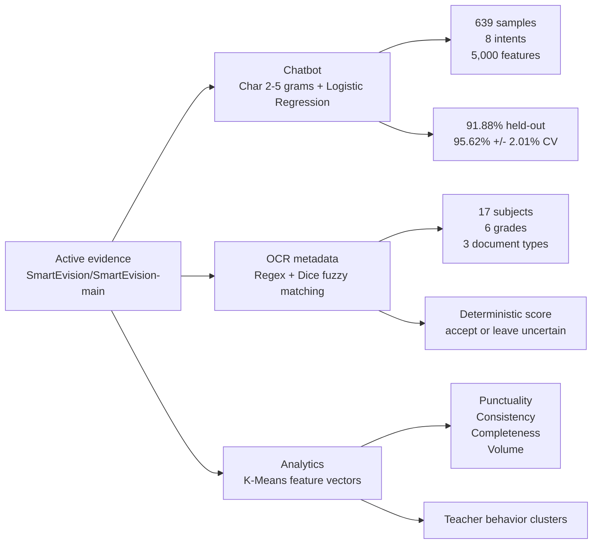
```mermaid
flowchart LR
    A[Active evidence<br/>SmartEvision/SmartEvision-main] --> B[Chatbot<br/>Char 2-5 grams + Logistic Regression]
    A --> C[OCR metadata<br/>Regex + Dice fuzzy matching]
    A --> D[Analytics<br/>K-Means feature vectors]
    B --> E[639 samples<br/>8 intents<br/>5,000 features]
    B --> F[91.88% held-out<br/>95.62% +/- 2.01% CV]
    C --> G[17 subjects<br/>6 grades<br/>3 document types]
    C --> H[Deterministic score<br/>accept or leave uncertain]
    D --> I[Punctuality<br/>Consistency<br/>Completeness<br/>Volume]
    D --> J[Teacher behavior clusters]
```

```mermaid
flowchart LR
    L[Duplicate folder<br/>SmartEvision-main (5)/SmartEvision-main] --> L1[Legacy ml_training results<br/>CV mean 77.93%]
    L --> L2[Older Naive Bayes claims<br/>in patent/support files]
    L1 -.-> X[Do not use as current-system evidence]
    L2 -.-> X
    A[Current live path] --> X1[Use active folder evidence]
```

## 2. Chatbot: Measured Classification Results

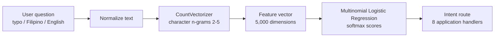
```mermaid
flowchart LR
    Q[User question<br/>typo / Filipino / English] --> N[Normalize text]
    N --> V[CountVectorizer<br/>character n-grams 2-5]
    V --> X[Feature vector<br/>5,000 dimensions]
    X --> M[Multinomial Logistic Regression<br/>softmax scores]
    M --> R[Intent route<br/>8 application handlers]
```

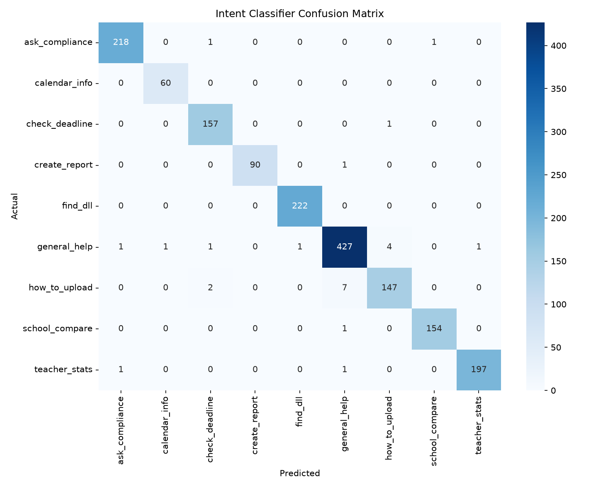

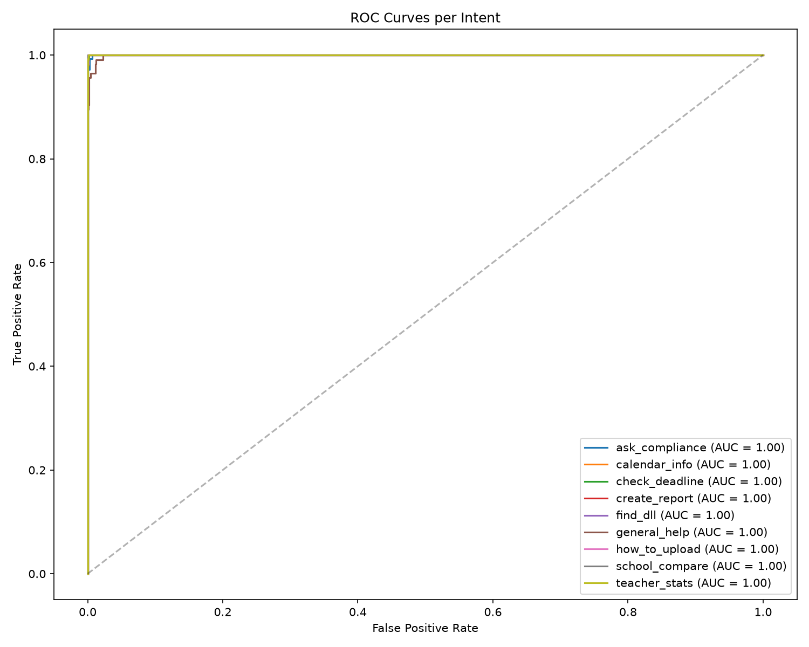

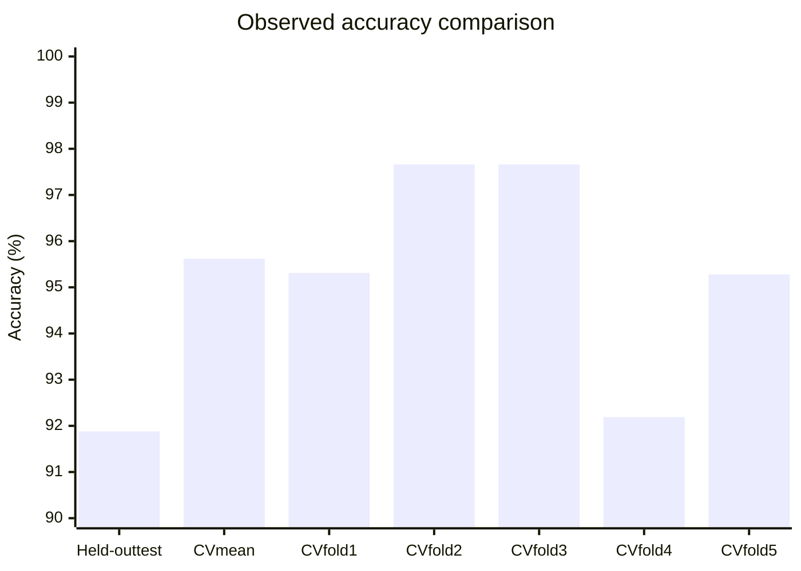
```mermaid
xychart-beta
    title "Observed accuracy comparison"
    x-axis [Held-out test, CV mean, CV fold 1, CV fold 2, CV fold 3, CV fold 4, CV fold 5]
    y-axis "Accuracy (%)" 90 --> 100
    bar [91.88, 95.62, 95.31, 97.66, 97.66, 92.19, 95.28]
```

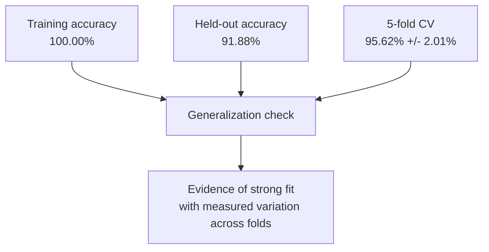
```mermaid
flowchart TB
    T[Training accuracy<br/>100.00%] --> G[Generalization check]
    H[Held-out accuracy<br/>91.88%] --> G
    C[5-fold CV<br/>95.62% +/- 2.01%] --> G
    G --> S[Evidence of strong fit<br/>with measured variation across folds]
```

## 3. Why Character N-Grams: Vector-Level Visualization

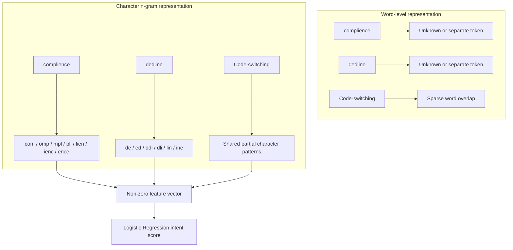
```mermaid
flowchart TB
    subgraph W[Word-level representation]
        W1[complience] --> W2[Unknown or separate token]
        W3[dedline] --> W4[Unknown or separate token]
        W5[Code-switching] --> W6[Sparse word overlap]
    end
    subgraph C[Character n-gram representation]
        C1[complience] --> C2[com / omp / mpl / pli / lien / ienc / ence]
        C3[dedline] --> C4[de / ed / ddl / dli / lin / ine]
        C5[Code-switching] --> C6[Shared partial character patterns]
    end
    C2 --> V[Non-zero feature vector]
    C4 --> V
    C6 --> V
    V --> L[Logistic Regression intent score]
```

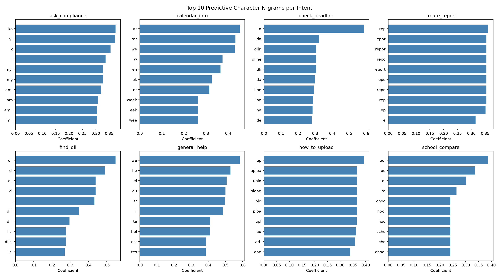

## 4. Model Selection: Requirement-to-Evidence Matrix

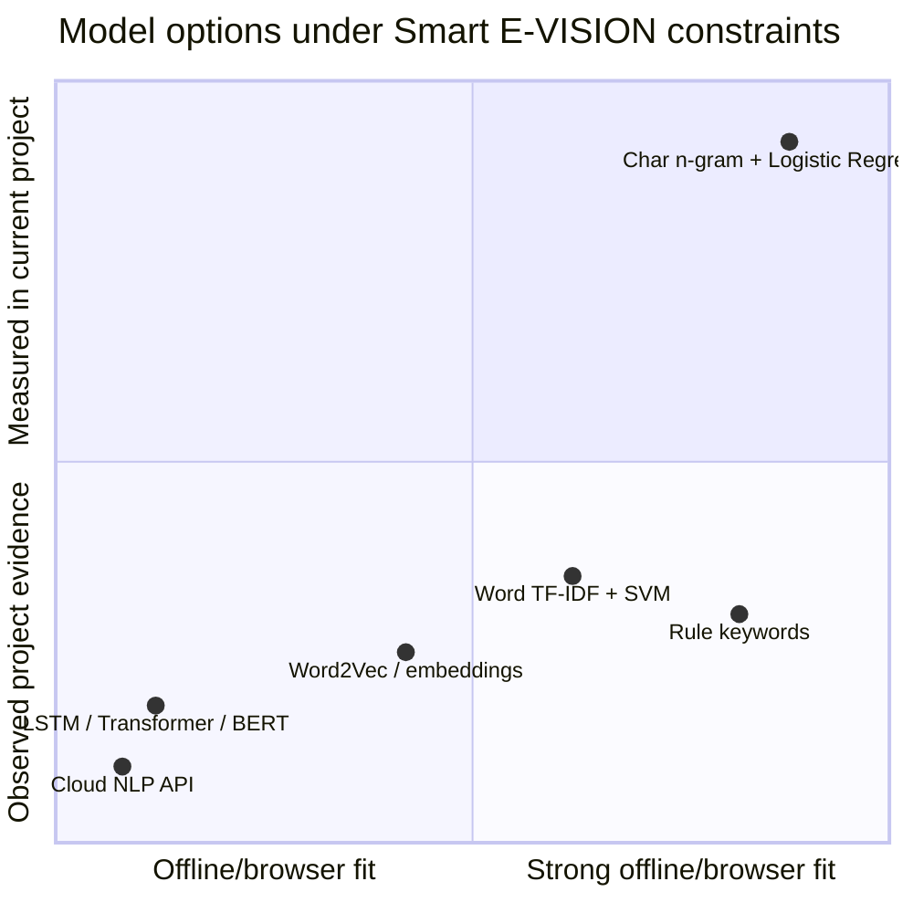
```mermaid
quadrantChart
    title Model options under Smart E-VISION constraints
    x-axis "Offline/browser fit" --> "Strong offline/browser fit"
    y-axis "Observed project evidence" --> "Measured in current project"
    "Char n-gram + Logistic Regression" : [0.88, 0.92]
    "Word TF-IDF + SVM" : [0.62, 0.35]
    "Rule keywords" : [0.82, 0.30]
    "Word2Vec / embeddings" : [0.42, 0.25]
    "LSTM / Transformer / BERT" : [0.12, 0.18]
    "Cloud NLP API" : [0.08, 0.10]
```

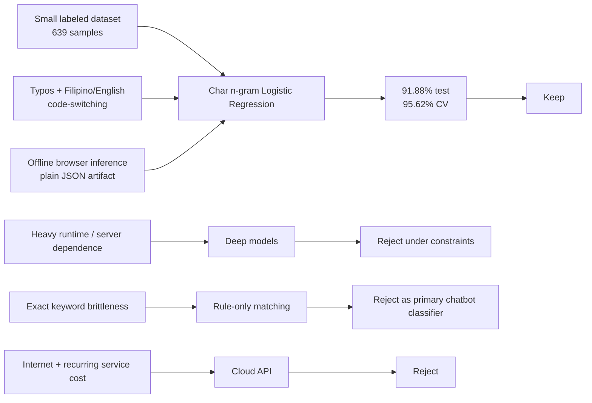
```mermaid
flowchart LR
    A[Small labeled dataset<br/>639 samples] --> D[Selected method]
    B[Typos + Filipino/English<br/>code-switching] --> D
    C[Offline browser inference<br/>plain JSON artifact] --> D
    D[Char n-gram Logistic Regression] --> E[91.88% test<br/>95.62% CV]
    E --> F[Keep]
    G[Heavy runtime / server dependence] --> H[Deep models] --> I[Reject under constraints]
    J[Exact keyword brittleness] --> K[Rule-only matching] --> L[Reject as primary chatbot classifier]
    M[Internet + recurring service cost] --> N[Cloud API] --> O[Reject]
```

## 5. OCR Metadata Extraction: Decision Visualization

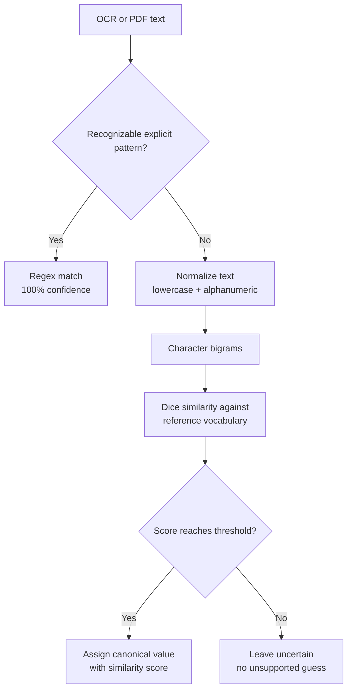
```mermaid
flowchart TB
    A[OCR or PDF text] --> B{Recognizable explicit pattern?}
    B -->|Yes| C[Regex match<br/>100% confidence]
    B -->|No| D[Normalize text<br/>lowercase + alphanumeric]
    D --> E[Character bigrams]
    E --> F[Dice similarity against<br/>reference vocabulary]
    F --> G{Score reaches threshold?}
    G -->|Yes| H[Assign canonical value<br/>with similarity score]
    G -->|No| I[Leave uncertain<br/>no unsupported guess]
```

```mermaid
flowchart LR
    X[Le@rning Ar3a] --> N[learning area]
    Y[Learning Area] --> N2[learning area]
    N --> D[Shared character bigrams]
    N2 --> D
    D --> S[Dice coefficient]
    S --> R[Candidate score]
    R --> Q{Threshold}
    Q -->|Pass| P[Learning Area]
    Q -->|Fail| U[Uncertain]
```

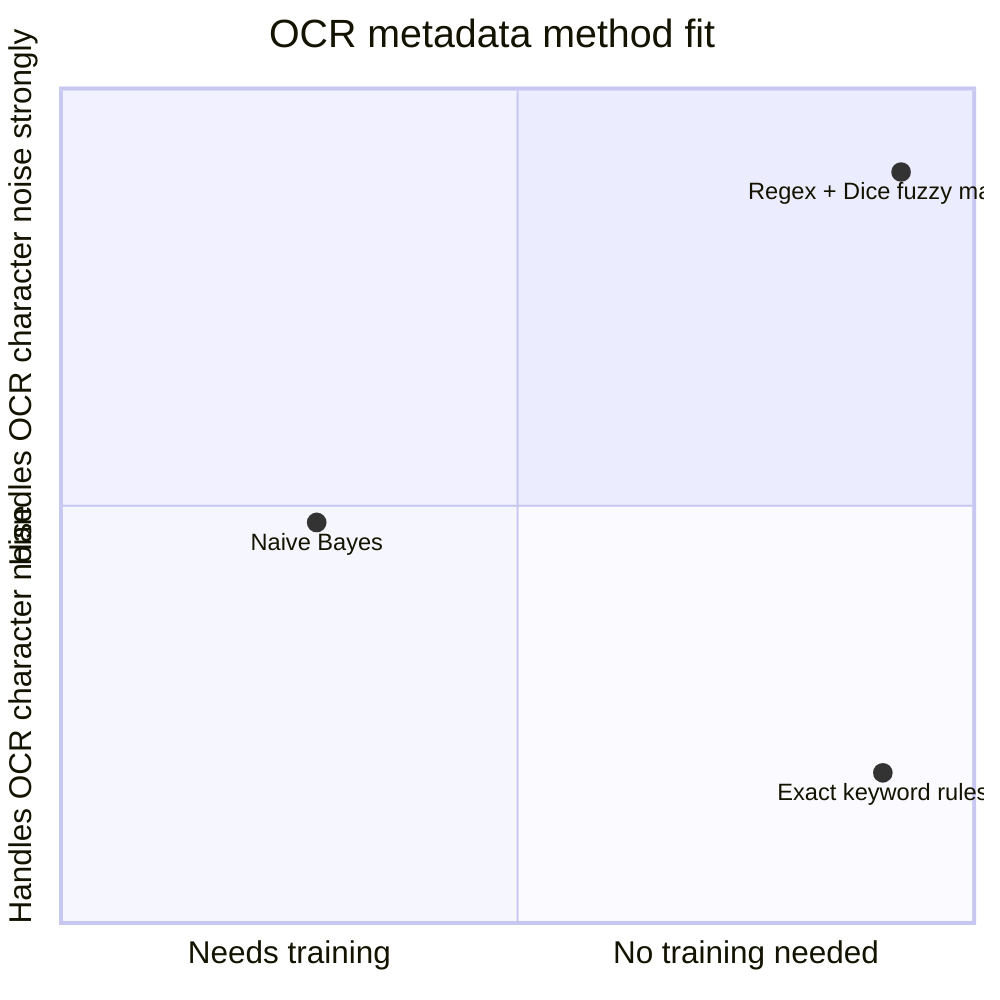
```mermaid
quadrantChart
    title OCR metadata method fit
    x-axis "Needs training" --> "No training needed"
    y-axis "Handles OCR character noise" --> "Handles OCR character noise strongly"
    "Regex + Dice fuzzy matching" : [0.92, 0.90]
    "Naive Bayes" : [0.28, 0.48]
    "Exact keyword rules" : [0.90, 0.18]
```

### 5.1 Complete Naive Bayes Training Results

These are the recorded legacy Naive Bayes results from `ml_training/results/training_results.json`, dated 2026-07-09. They are included for comparison only; the active OCR implementation is Regex + Dice fuzzy matching.

| Classifier | Samples | Vocabulary | Holdout accuracy | 5-fold CV | CV standard deviation |
|---|---:|---:|---:|---:|---:|
| Subject | 290 | 53 | 85.86% | 77.93% | 2.53% |
| Grade Level | 435 | 53 | 100.00% | 99.77% | 0.46% |
| Document Type | 290 | 53 | 100.00% | 100.00% | 0.00% |

#### Subject classifier: per-class results

| Subject | Precision | Recall | F1 | Support |
|---|---:|---:|---:|---:|
| AP | 100.00% | 100.00% | 100.00% | 20 |
| EPP | 100.00% | 60.00% | 75.00% | 20 |
| English | 100.00% | 100.00% | 100.00% | 28 |
| Filipino | 77.78% | 77.78% | 77.78% | 36 |
| GMRC | 80.85% | 86.36% | 83.52% | 44 |
| Language | 100.00% | 100.00% | 100.00% | 8 |
| MAPEH | 77.78% | 70.00% | 73.68% | 30 |
| Makabansa | 100.00% | 100.00% | 100.00% | 24 |
| Mathematics | 76.00% | 86.36% | 80.85% | 44 |
| Reading and Literacy | 100.00% | 100.00% | 100.00% | 8 |
| Science | 80.00% | 85.71% | 82.76% | 28 |
| **Macro average** | **90.22%** | **87.84%** | **88.51%** | **290** |
| **Weighted average** | **86.46%** | **85.86%** | **85.72%** | **290** |

The subject confusion matrix contains 249 correct predictions out of 290 and 41 errors. The largest error groups were EPP (8 missed), MAPEH (9 missed), and Mathematics (6 missed); the remaining errors were distributed among GMRC, Filipino, and Science.

#### Grade-level classifier: per-class results

| Grade | Precision | Recall | F1 | Support |
|---|---:|---:|---:|---:|
| Grade 1 | 100.00% | 100.00% | 100.00% | 60 |
| Grade 2 | 100.00% | 100.00% | 100.00% | 48 |
| Grade 3 | 100.00% | 100.00% | 100.00% | 72 |
| Grade 4 | 100.00% | 100.00% | 100.00% | 51 |
| Grade 5 | 100.00% | 100.00% | 100.00% | 102 |
| Grade 6 | 100.00% | 100.00% | 100.00% | 102 |
| **Macro and weighted averages** | **100.00%** | **100.00%** | **100.00%** | **435** |

The grade-level confusion matrix is diagonal: all 435 records were classified correctly.

#### Document-type classifier: per-class results

| Document type | Precision | Recall | F1 | Support |
|---|---:|---:|---:|---:|
| DLL | 100.00% | 100.00% | 100.00% | 290 |
| **Macro and weighted averages** | **100.00%** | **100.00%** | **100.00%** | **290** |

This is not a three-class evaluation: the recorded test data contains only DLL examples, so the one-cell confusion matrix reports 290 DLL predictions. ISP and ISR are not represented in this recorded evaluation.

### 5.2 Complete Dice-Coefficient Results

Dice matching does not train on samples and therefore has no training accuracy, holdout accuracy, cross-validation score, or per-class support. It compares normalized character bigrams against a fixed reference vocabulary. These scores were computed with the active `fuzzyClassifier.ts` implementation.

| OCR input | Reference value | Dice similarity | Result at documented threshold |
|---|---|---:|---|
| Le@rning Ar3a | Learning Area | 69.6% | Accepted |
| Mathematiks | Mathematics | 80.0% | Accepted |
| Asigntura | Asignatura | 82.4% | Accepted |
| Engliish | English | 92.3% | Accepted |
| Filipino0 | Filipino | 93.3% | Accepted |
| Daly Lson Log | Daily Lesson Log | 74.1% | Accepted |
| Grde 4 | Grade 4 | 72.7% | Accepted |
| Baitng | Baitang | 72.7% | Accepted |
| Sciense | Science | 66.7% | Accepted |

All 9 documented corrupted inputs exceeded the 40% upper bound of the stated 25-40% acceptance range. Exact regex matches return 100% confidence, while inputs below the relevant fuzzy threshold return an uncertain result rather than a forced class.

### 5.3 Results Comparison and Interpretation

| Measure | Naive Bayes baseline | Regex + Dice matcher |
|---|---|---|
| Training data | Required: 290 subject, 435 grade, 290 document records | None; fixed reference lists |
| Subject evaluation | 85.86% holdout; 77.93% +/- 2.53% CV | 9/9 documented OCR examples accepted; 66.7-93.3% similarity |
| Grade evaluation | 100.00% holdout; 99.77% +/- 0.46% CV | Regex exact matches return 100%; fuzzy fallback supplies a similarity score |
| Document-type evaluation | 100.00%, but DLL-only recorded data | Regex exact matches return 100%; fuzzy fallback supplies a similarity score |
| OCR typo handling | Not measured in the recorded NB report | Measured by the nine Dice examples above |
| Retraining requirement | Yes | No |

These figures should not be presented as a single accuracy race. Naive Bayes was evaluated with labeled train/test data, whereas Dice was evaluated as a deterministic similarity procedure on representative OCR corruptions. The valid conclusion is that the active method has direct evidence of character-noise tolerance and requires no training corpus, while the legacy Naive Bayes numbers provide a reproducible statistical baseline with a notable subject-classification weakness.

### 5.4 Naive Bayes Vector and Probability Diagrams

```mermaid
flowchart LR
    A[OCR text] --> B[Lowercase and remove punctuation]
    B --> C[Tokenize words longer than 2 characters]
    C --> D[CountVectorizer vocabulary<br/>53 tokens]
    D --> E[Document-term vector<br/>x = counts per token]
    E --> F[Multinomial Naive Bayes]
    F --> G[Prior P(class)]
    F --> H[Laplace-smoothed P(token | class)]
    G --> I[Sum log probabilities]
    H --> I
    I --> J[Highest posterior class]
```

```mermaid
flowchart TB
    X[Input vector x] --> S[For each candidate class c]
    S --> P[log P(c)]
    S --> W[Sum over tokens: x_i * log P(token_i | c)]
    P --> L[Log-posterior score]
    W --> L
    L --> M[Choose maximum score]
    M --> R[Predicted subject, grade, or document type]
```

For a token-count vector $x=(x_1, x_2, ..., x_V)$, the recorded implementation scores each
class with the multinomial Naive Bayes expression:

$$
\log P(c \mid x) \propto \log P(c) + \sum_{i=1}^{V} x_i\log P(w_i \mid c)
$$

Laplace smoothing was applied as:

$$
P(w_i \mid c)=\frac{N_{i,c}+1}{N_c+V}
$$

The exported vocabulary contains 53 tokens. Example high-weight tokens visible in the
recorded model include `mathematics` for Mathematics, `science` for Science, `filipino` for
Filipino, `gmrc` for GMRC, and the grade number tokens for the Grade 1-6 classes.

### 5.5 Naive Bayes Visualizations and Artifacts

The following plots are the copied recorded artifacts from the legacy training run. They are
linked locally so the panel can inspect the actual model output rather than only the summary
tables above.

#### Subject classifier

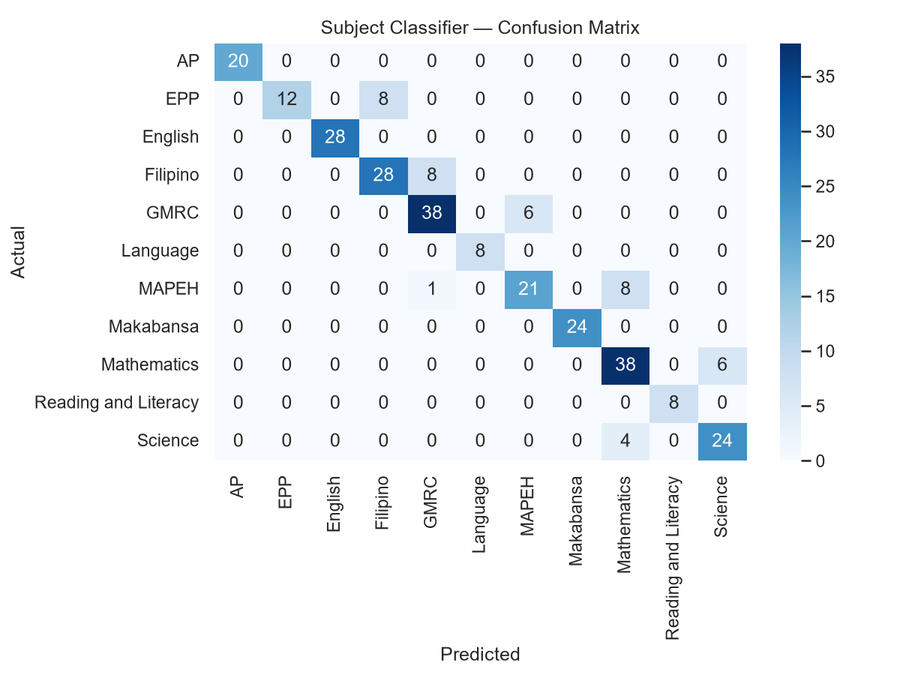

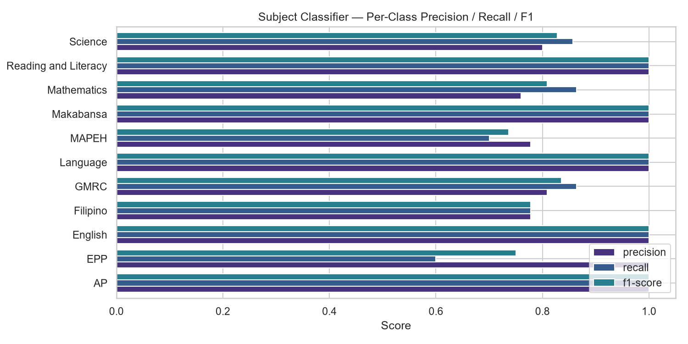

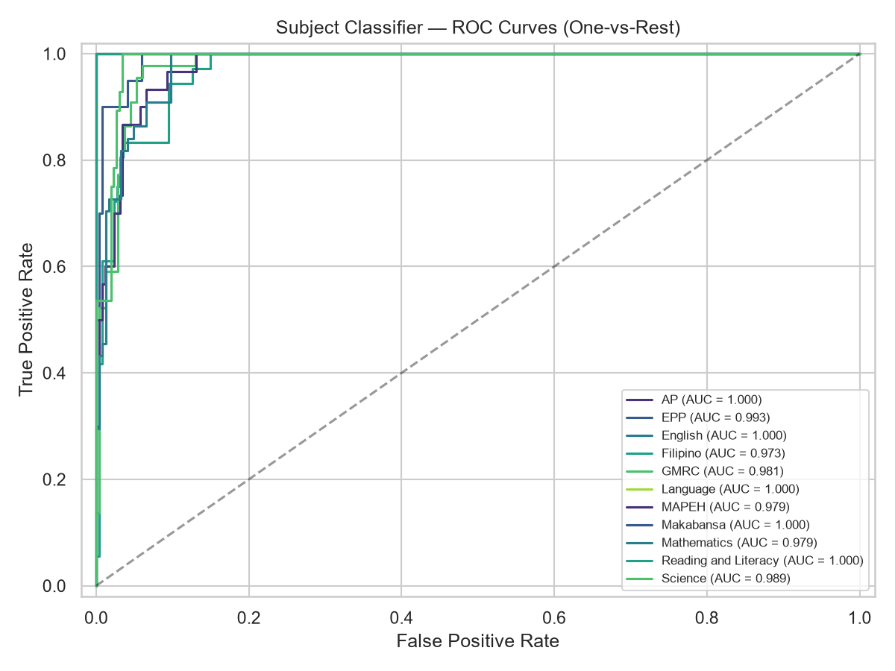

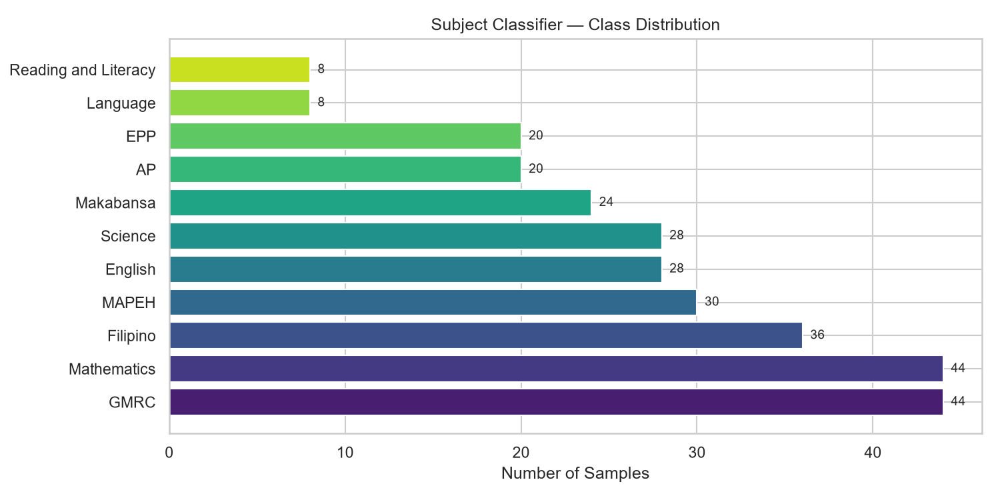

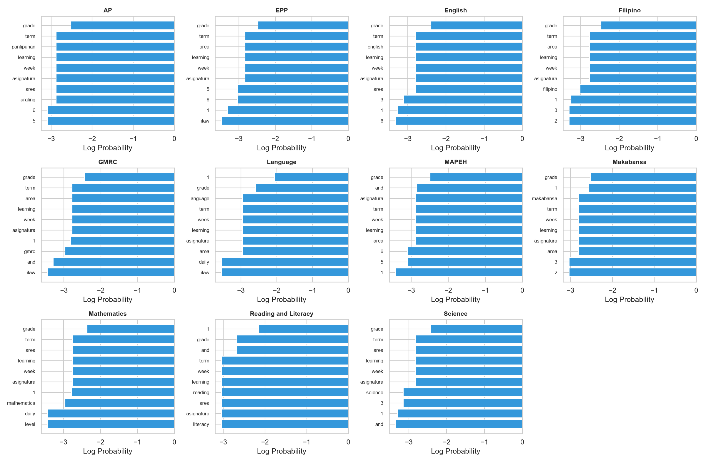

#### Grade-level classifier

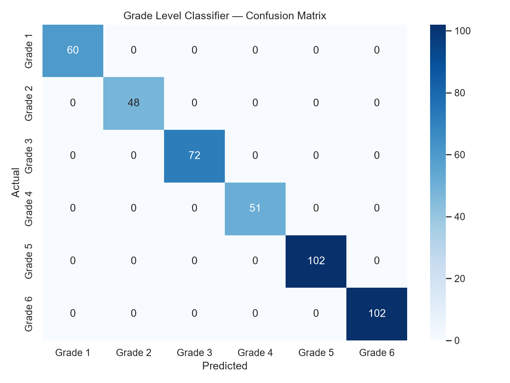

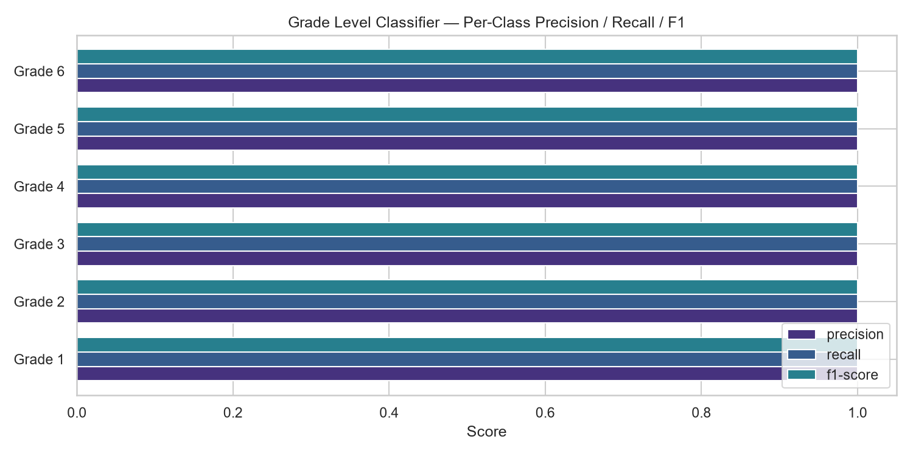

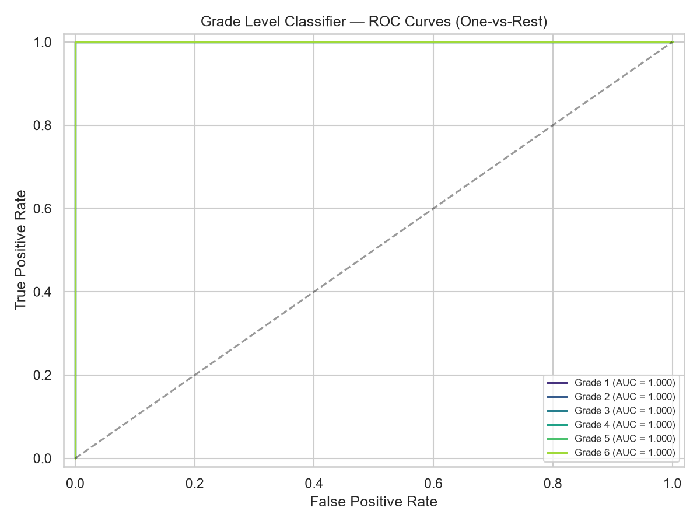

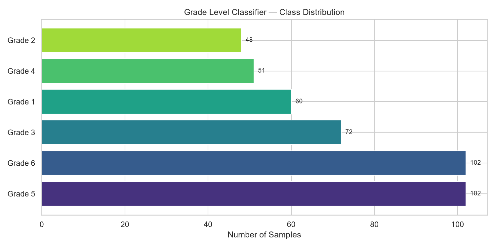

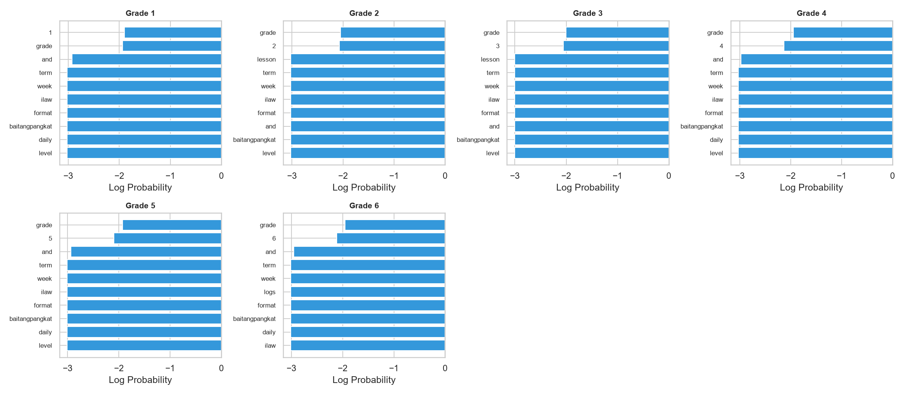

#### Document-type classifier

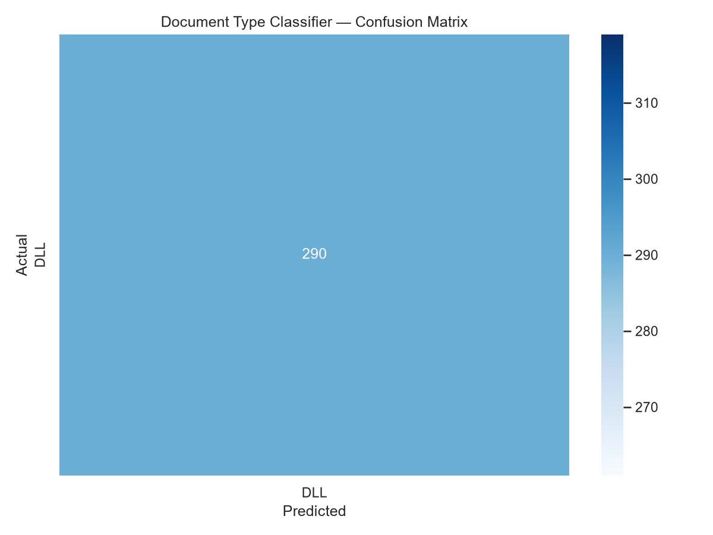

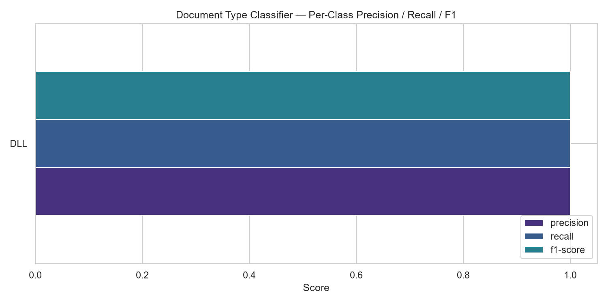

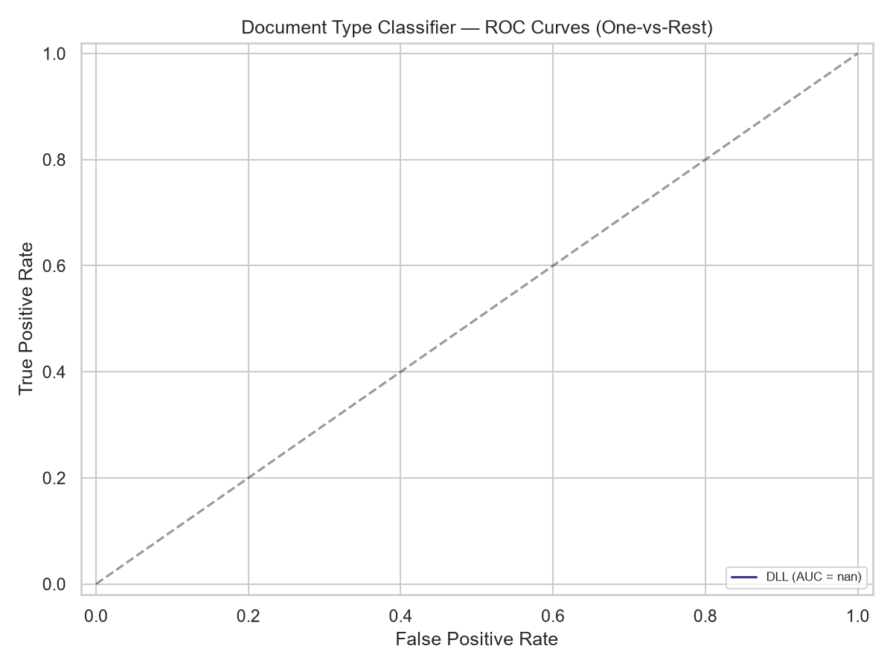

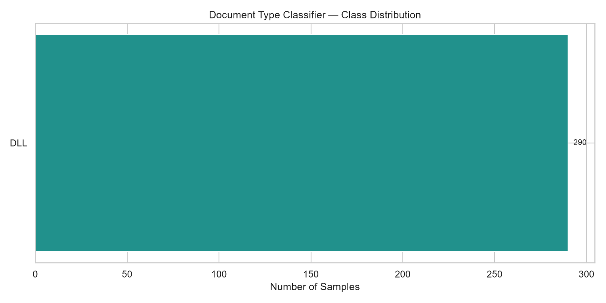

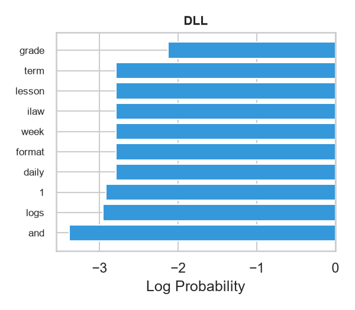

#### Overall comparison visualization

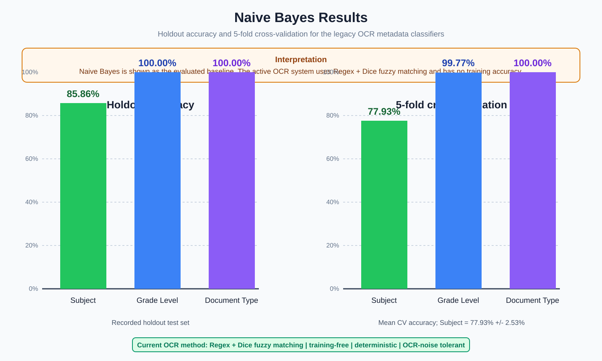

## 6. Analytics: Behavioral Feature Vectors

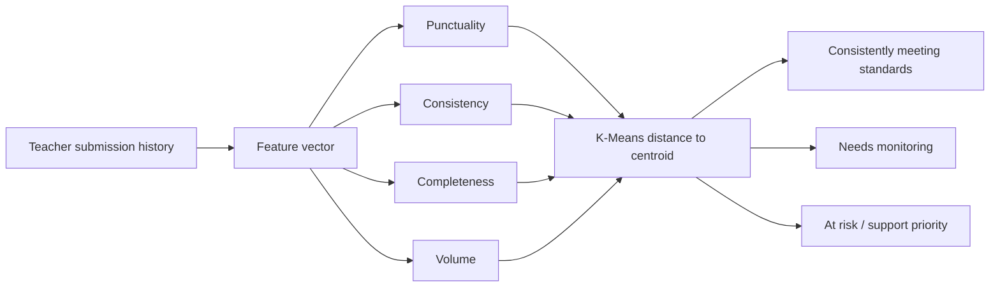
```mermaid
flowchart LR
    T[Teacher submission history] --> V[Feature vector]
    V --> V1[Punctuality]
    V --> V2[Consistency]
    V --> V3[Completeness]
    V --> V4[Volume]
    V1 --> K[K-Means distance to centroid]
    V2 --> K
    V3 --> K
    V4 --> K
    K --> C1[Consistently meeting standards]
    K --> C2[Needs monitoring]
    K --> C3[At risk / support priority]
```

## 7. End-to-End Intelligent Component Map

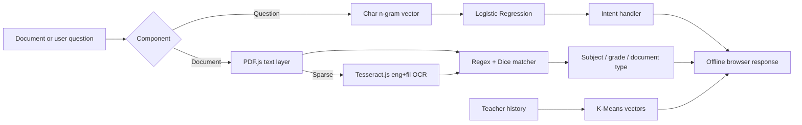
```mermaid
flowchart LR
    U[Document or user question] --> P{Component}
    P -->|Question| N[Char n-gram vector]
    N --> I[Logistic Regression]
    I --> R[Intent handler]
    P -->|Document| O[PDF.js text layer]
    O -->|Sparse| T[Tesseract.js eng+fil OCR]
    O --> F[Regex + Dice matcher]
    T --> F
    F --> M[Subject / grade / document type]
    R --> A[Offline browser response]
    M --> A
    H[Teacher history] --> K[K-Means vectors]
    K --> A
```

## 8. Panel Takeaway

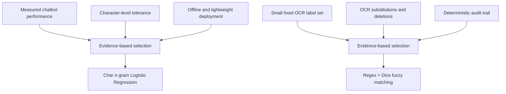
```mermaid
flowchart TB
    A[Measured chatbot performance] --> D[Evidence-based selection]
    B[Character-level tolerance] --> D
    C[Offline and lightweight deployment] --> D
    D --> E[Char n-gram Logistic Regression]
    F[Small fixed OCR label set] --> G[Evidence-based selection]
    H[OCR substitutions and deletions] --> G
    I[Deterministic audit trail] --> G
    G --> J[Regex + Dice fuzzy matching]
```