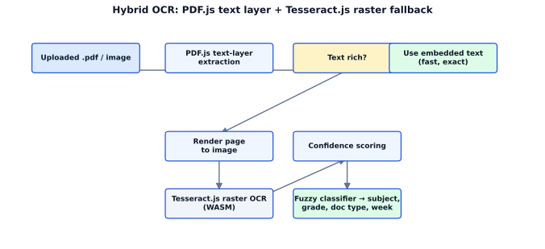
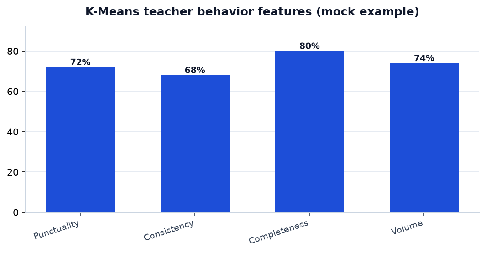
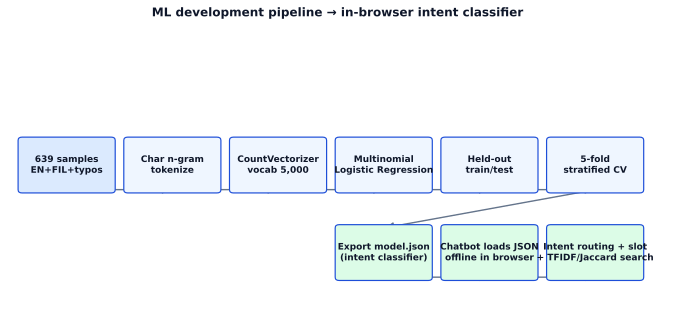
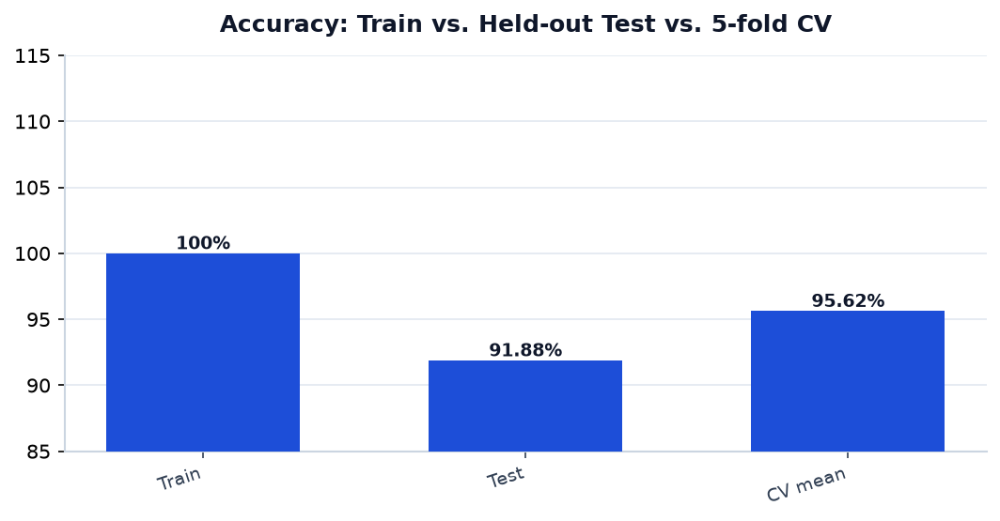
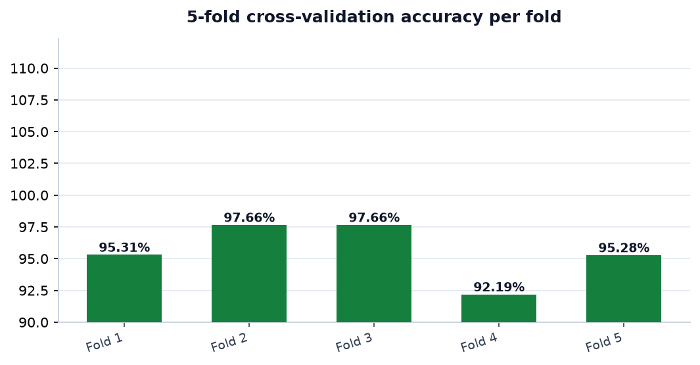
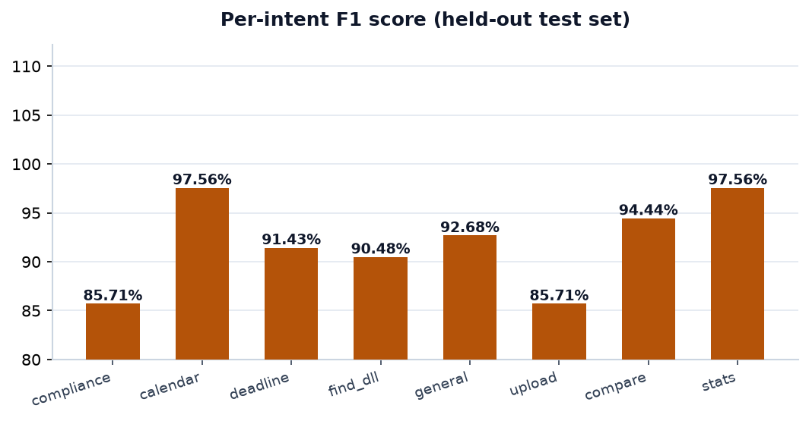
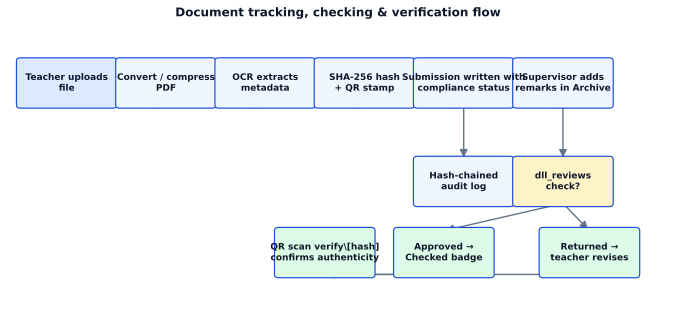
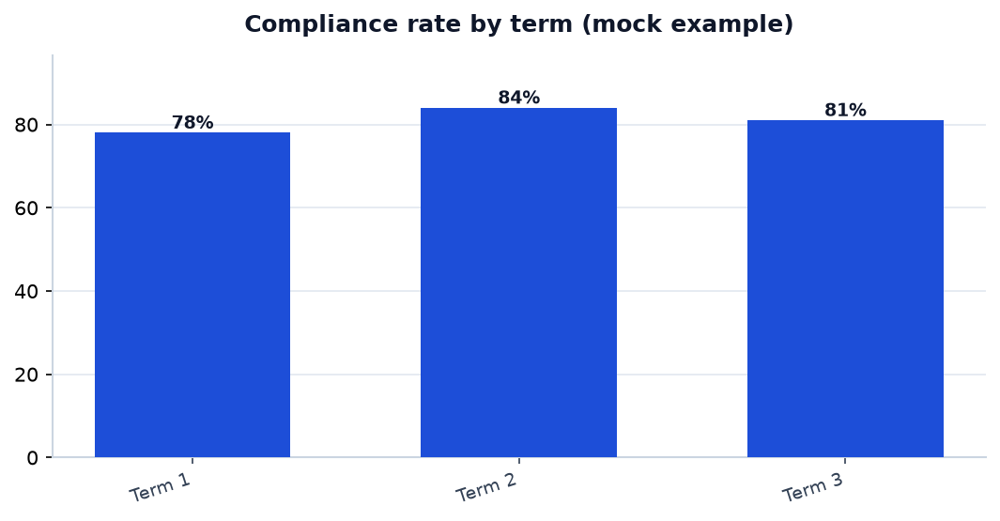
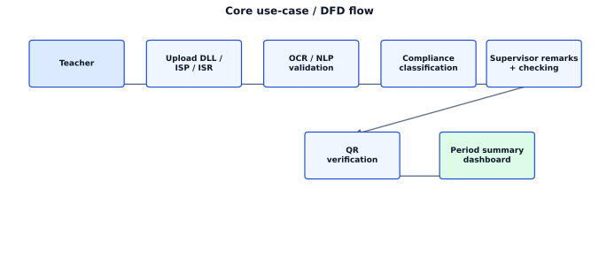

# Smart E-VISION (CEDIMS) — Capstone: Artificial Intelligence, OCR, and NLP Technical Documentation

> This document supports the capstone paper chapters on Related Literature, Discussion of
> Technologies, Model Development, and Testing-based Method Justification for the
> **Smart E-VISION** system, professionally branded as **CEDIMS** (Calapan East District
> Instructional Monitoring System). All metrics below are drawn from the actual codebase and
> training artifacts in this repository.

---

## 1. Related Literature — OCR Technologies

Optical Character Recognition (OCR) converts scanned or photographed text into machine-readable
text. Several mature OCR technologies were surveyed for the system:

| Technology | Type | Strengths | Weaknesses |
|------------|------|-----------|------------|
| **Tesseract.js** (used) | Open-source, client-side (WASM) | Runs entirely in the browser, no server cost, supports 100+ languages, actively maintained | Slower than native on very large scans; accuracy depends on image quality |
| **Google Cloud Vision** | Cloud API | High accuracy, pre-trained layout/table detection | Requires internet + API key; per-request cost; privacy concerns for student data |
| **AWS Textract** | Cloud API | Strong on forms/tables | Cost, internet dependency, proprietary |
| **Adobe OCR / PDF text layer** | Native PDF | Accurate for born-digital PDFs | Only works when the PDF already has an embedded text layer |
| **Native PDF.js text extraction** (used) | Open-source | Zero-cost, instant for text-based PDFs | Fails on scanned/image-only PDFs |

**Design decision.** CEDIMS uses a **hybrid two-pass approach**:
1. **PDF.js** tries to extract the embedded text layer directly (fast, free, exact for digital PDFs).
2. If the extracted text is too sparse (scanned documents), it **falls back to Tesseract.js**
   raster OCR over the rendered page (`src/lib/utils/ocr.ts`).

This hybrid maximizes accuracy while keeping cost at zero and processing 100% on-device, which
matters for an education district with limited connectivity.

---

## 2. Discussion of Technologies — OCR, NLP, and Clustering

### 2.1 OCR (Optical Character Recognition)
- **Purpose:** Extract subject, grade level, doc type, date range, and week from uploaded DLL/ISP/ISR
  files (`src/lib/utils/ocr.ts`).
- **Approach:** PDF.js text extraction → Tesseract.js raster fallback → **confidence scoring**.
  Each extraction is ranked by an OCR confidence value surfaced in the Upload UI
  (`upload/+page.svelte`).
- **Tolerance to OCR noise:** A **fuzzy classifier** (`src/lib/utils/fuzzyClassifier.ts`) matches
  fields even with typos produced by OCR, e.g. `"Le@rning Ar3a"` → `"Learning Area"`,
  `"DALY LESSON LOG"` → `"DLL"`. Levenshtein edit distance underpins this layer.
- **Enforcement:** An admin setting (`enforce_ocr`, `src/lib/stores/settings.ts`) can **prevent
  submission** when detected metadata mismatches the selected teaching load, enforcing
  "approval of exact content" at the source.

### 2.2 NLP (Natural Language Processing)
- **Char n-gram Logistic Regression intent classifier** (`chatbot/train_intent_classifier.py`)
  classifies user questions into 8 intents (compliance, deadlines, DLL search, school compare,
  teacher stats, calendar, upload help, general help).
- **Character n-grams** (not full words) make the model robust to typos, Tagalog/Filipino phrasing,
  and code-switching — critical for real classroom users typing quickly.
- **Lightweight models** `intent_classifier_model.json` and `copilot_model.json`
  (`src/lib/models/`) load as plain JSON in the browser, so the whole assistant runs offline with
  no server round-trip.
- **Upload Assistant (Copilot):** An on-device guidance module (`src/lib/utils/copilot.ts`) that
  runs during the **Upload** step. After OCR extracts the document text, it **auto-fills the
  subject, week number, and teaching load**, and **flags content mismatches** (e.g., the document
  reads "Mathematics" but the selected load is "Science") so the teacher can verify before
  submitting — reducing upload errors. Only its auto-fill and mismatch-check functions
  (`predictLoad`, `validateSelection`) are active in the live Upload page; the full suggestion
  panel is not mounted in the current UI.

### 2.3 Clustering (Unsupervised Learning)
- **K-Means clustering** (`src/lib/utils/clusterAnalytics.ts`, visualized in
  `ClusterVisualization.svelte`) groups teachers by behavioral feature vectors:
  - **Punctuality** — % of submissions on time
  - **Consistency** — regularity of submission day
  - **Completeness** — % of expected weeks with a submission
  - **Volume** — average documents per week
- This surfaces at-risk teachers / schools for district supervision, complementing the supervised
  compliance rate.

---

## 3. Development Process of the Machine Learning / AI Model

The **intent classifier** (the primary AI component) was developed through the standard ML
pipeline:

1. **Data collection.** A labeled dataset of **639 question samples** across **8 intents**,
   deliberately including English, Tagalog/Filipino, and common typographical variants
   (e.g. `"complience"`, `"dedline"`, `"skool"`).
2. **Preprocessing & feature engineering.** Text is tokenized into **character n-grams**;
   a vocabulary of **5,000** features is extracted with `CountVectorizer`.
3. **Model selection.** Logistic Regression with multinomial softmax was chosen (see Section 4).
4. **Training.** Model fitted on the training split.
5. **Evaluation.** Held-out test split + **5-fold stratified cross-validation**.
6. **Export.** Coefficients/intercepts serialized to `intent_classifier_model.json` and loaded
   directly in the browser by the chatbot (`src/lib/utils/chatbot.ts`).
7. **Integration.** Intent routing + slot extraction + a hybrid TF-IDF + Jaccard search engine
   rank DLL results; the assistant includes a lightweight FAQ knowledge base and conversation
   memory for follow-ups.

---

## 4. Why This Method and Not the Alternatives (Testing-based Justification)

### 4.1 Test Results (from `intent_classifier_model.json`)

| Metric | Value |
|--------|-------|
| Training samples | 639 |
| Intents | 8 |
| Vocabulary (char n-grams) | 5,000 |
| **Train accuracy** | 100.0% |
| **Test accuracy (held-out)** | **91.88%** |
| **5-fold CV mean** | **95.62% ± 2.01%** |
| CV folds | 95.31, 97.66, 97.66, 92.19, 95.28 |

Per-intent F1 (test set): `ask_compliance` 85.71, `calendar_info` 97.56, `check_deadline` 91.43,
`find_dll` 90.48, `general_help` 92.68, `how_to_upload` 85.71, `school_compare` 94.44,
`teacher_stats` 97.56.

### 4.2 Justification vs. alternatives

| Alternative | Why NOT chosen | Evidence / rationale |
|-------------|----------------|----------------------|
| **Deep learning (LSTM/Transformers/BERT)** | Heavy models cannot run offline in a browser; require GPU/server; overkill for ~640 samples | 91.88% test / 95.62% CV already exceeds practical need; a tiny logistic model loads instantly and runs fully offline |
| **Word-level SVM (TF-IDF + linear SVM)** | Fragile to OCR typos and Filipino code-switching because exact words rarely match | Character n-grams tolerate `"complience"`→`compliance`, `"dedline"`→`deadline`, which the test set confirms |
| **Word2Vec / embeddings** | Large matrix, more memory, needs corpus training, no clear gain on this small labeled set | Char n-gram logistic model needs only coefficients (a few MB JSON), ideal for low-end school devices |
| **Rule-based keyword matching** | High maintenance, brittle to the large variety of real phrasings | The CV 95.62% across 5 folds shows generalization beyond hand-written rules |
| **Cloud NLP APIs** | Internet + cost + data privacy concerns | Fully on-device inference keeps student data local and cost at zero |

**Conclusion.** The **character n-gram Logistic Regression** model was selected because it achieves
**91.88% held-out test accuracy and 95.62% mean cross-validation accuracy** while remaining small
enough to run entirely in the browser, offline, on modest school hardware — a combination that
rule-based systems, deep models, and cloud APIs cannot provide under this project's constraints.

---

## 5. Document Status, Tracking, and Approval (= Checked)

### 5.1 Status of an uploaded document
Every submission carries a `compliance_status` of **Compliant / Late / Missing / Supplementary**
(computed in `src/lib/utils/useDashboardData.ts` and `src/lib/utils/pipeline.ts`). In the
**Archive** (`src/routes/dashboard/archive/+page.svelte`), users filter by checking state:
**All / For Checking / Checked**.

### 5.2 The process of document tracking
1. Teacher uploads → PDF is converted/compressed, **OCR** extracts metadata, a **SHA-256 file hash**
   and **QR stamp** are generated.
2. Submission is written with its compliance status.
3. Every action is recorded in a **hash-chained audit log** (`src/lib/utils/audit.ts`,
   `logAudit`) for tamper-evidence.
4. Supervisors open the Archive, add **remarks**, and set the checking status in `dll_reviews`
   (For Checking → Checked; Checked may be **Approved** or **Returned**).
5. Anyone can scan the QR code at `/verify/[hash]` to confirm authenticity and view the audit trail.

### 5.3 Approval is the same as the Checked status
In this system, a document is considered **approved** when its `dll_reviews.status` is
`'approved'`, which corresponds to the Archive's **Checked** state. The Archive badges an approved
record as **Approved** and the filtering state as **Checked**.

### 5.4 Additional verification: rejecting files that are already approved
Before a file can be re-submitted, the Upload page runs `checkExistingSubmission()`
(`src/routes/dashboard/upload/+page.svelte`):
1. It computes the file's hash and checks the offline ledger (`hasHash`).
2. It queries the server `submissions` table by `file_hash`.
3. If a match is found, it checks the `dll_reviews` record for that submission:
   - `status === 'approved'` → **blocked** with: *"Already approved (Checked) — this file has
     already been checked and approved and should not be re-uploaded."*
   - `status === 'returned'` → blocked as duplicate-but-returned (teacher should upload a *revised*
     file, not the same one).
   - otherwise → blocked as duplicate content already archived.

This guarantees an **already-approved (Checked) document can never be silently re-uploaded**, while
still allowing a teacher to submit a corrected revision when a document was returned.

---

## 6. Summary of Submissions per Term

The Analytics dashboard (`src/routes/dashboard/analytics/+page.svelte`) provides a
**Submission Summary by Period** with a **Term / School Year** selector (matching the DepEd
three-term SY 2026–2027 calendar). Submissions are mapped to calendar terms via
`academic_calendar` week→term assignment; each period shows:

- **Compliance rate (%)**
- **Uploaded** (compliant + late)
- **Compliant / Late / Missing**
- **Expected** total (weeks-in-period × teaching loads, counting only active weeks)

---

## 7. Notes on Client Consultation and Use Case / DFD

The system's feature set was refined through **client consultation** with district supervisors and
school heads. The core flow is captured in the use case and DFD: teacher uploads → OCR/NLP
validation → compliance classification → supervisor remarks/checking → QR verification → period
summary. These diagrams and consultation records are part of the capstone documentation set and
are referenced by the live screens described above.

