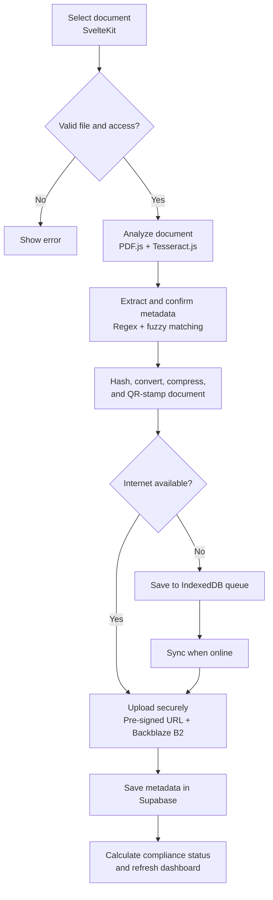
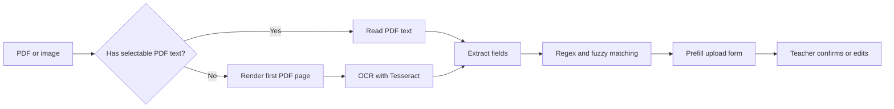

# SmartEvision Upload Process

This is the complete upload flow in simple terms. The upload process is the core workflow for archiving documents and measuring compliance.

## 1. The Complete Upload Flow

### Description of the Upload Process

Figure 1 shows SmartEvision's document-upload process. The system validates the selected file and the user's access, analyzes the document using PDF.js and Tesseract.js, and extracts metadata through regex and fuzzy matching. After the user confirms the metadata, the document is hashed, converted, compressed, and QR-stamped. It is then uploaded securely to Backblaze B2 when online or saved in an IndexedDB queue when offline. Finally, the metadata is stored in Supabase, the compliance status is calculated, and the dashboard is updated.

## 2. What the User Does

1. **Open Upload.** The system loads the teacher's active teaching loads and the district academic calendar. Cached copies are used when available.
2. **Choose a file.** The teacher drags a file into the drop zone or browses for one. Supported formats are PDF, DOC, DOCX, JPG, JPEG, and PNG. The maximum size comes from the system setting.
3. **Wait for Smart Detection.** The system reads the first page or image and tries to detect the document type, subject, grade level, week, date, school year, and raw text. Word files are converted online before analysis.
4. **Review the details.** The teacher checks the detected document type, week, subject, and teaching load, then edits any incorrect value. For a DLL, Teachers and Master Teachers must choose a teaching load.
5. **Start the upload.** The system checks the user's role, maintenance mode, file hash, and required selections. An identical file cannot be submitted again.
6. **Wait for processing.** The system converts non-PDF files to PDF, compresses the PDF, calculates its hash, and embeds a verification QR stamp.
7. **Receive the result.**
   - **Online:** The stamped PDF is uploaded securely to Backblaze B2 and its submission details are saved in Supabase.
   - **Offline:** The stamped PDF is saved in the browser's local IndexedDB queue. It is uploaded and recorded automatically after the connection returns.

## 3. Smart Detection in Plain Language

PDF text is used first. If a PDF has too little text, the first page is rendered and scanned with OCR. Images are scanned with Tesseract using English and Filipino language data. Regex rules identify document types and weeks; fuzzy matching helps tolerate OCR spelling mistakes. Detection is a suggestion, so the teacher remains responsible for confirming the fields.

## 4. Online and Offline Results

### Online upload

1. Check the local cache for the same hash.
2. Check Supabase for the same hash.
3. Request a short-lived pre-signed URL from `/api/storage/presign`.
4. Upload the stamped PDF directly to Backblaze B2.
5. Insert the submission metadata into Supabase.
6. Calculate the compliance status using the current time and academic-calendar deadline.
7. Cache the verified hash locally, create a success notification, and refresh dashboard data.

### Offline upload

1. Keep the same processed, compressed, and stamped PDF.
2. Store the file and metadata in the browser's IndexedDB queue.
3. Show **Saved offline** so the teacher knows the file was not lost.
4. When the browser is online again, run the secure upload and database-record steps.
5. Remove the item from the queue after successful synchronization.

An online upload that stalls during a network request also falls back to the offline queue. Hard errors, such as a duplicate file, are shown to the teacher instead of being queued.

## 5. Duplicate and Compliance Rules

- **Duplicate content:** The SHA-256 hash identifies identical file content. A matching local or server hash blocks the upload.
- **Multiple uploads:** More than one document may be uploaded for the same week. If the same teaching-load/week/document-type slot already has a submission, the additional document is stored as **supplementary** and does not increase compliance.
- **Compliant:** The document is submitted on or before the academic-calendar deadline.
- **Late:** The document is submitted after the deadline.
- **Supplementary:** The document is an additional upload for an already-covered slot.
- **Missing:** This is calculated for expected slots with no counted compliant or late submission; it is not an upload error status.

## 6. Who Can Upload What

| Role | Allowed document types | Teaching load required? |
|---|---|---|
| Teacher | DLL | Yes |
| Master Teacher | DLL, ISP, ISR | Yes for DLL |
| School Head | ISP, ISR | No |
| District Supervisor | None in this workflow | Not applicable |

## 7. Main User Messages

| Situation | What the user sees |
|---|---|
| File is too large | File-size error in the drop zone |
| Smart Detection is running | Detecting metadata / Scanning |
| Required DLL load is missing | Select a teaching load |
| Same content was found | Duplicate explanation, including the archived file when available |
| Internet upload succeeds | Archived successfully / Upload Successful |
| No connection or upload stalls | Saved offline; will sync when connected |
| Processing or server error | Error message and no successful completion state |

## 8. Implementation Map

| Responsibility | Source |
|---|---|
| Page controls, role checks, field review, and starting the pipeline | `src/routes/dashboard/upload/+page.svelte` |
| File selection and size validation | `src/lib/components/FileDropZone.svelte` |
| Conversion, compression, hashing, QR stamping, online upload, and offline fallback | `src/lib/utils/pipeline.ts` |
| PDF text extraction and image/PDF OCR | `src/lib/utils/ocr.ts` |
| Regex and fuzzy metadata matching | `src/lib/utils/fuzzyClassifier.ts` |
| Browser queue and automatic synchronization | `src/lib/utils/offline.ts` |
| Role permissions | `src/lib/utils/documentPermissions.ts` |
| Secure upload URL endpoint | `src/routes/api/storage/presign/+server.ts` |
| Submission data and compliance calculations | Supabase `submissions` and `academic_calendar` tables |

## 9. One-Sentence Summary

**Select a document, confirm the detected details, let SmartEvision prepare and verify it, then archive it online or save it locally until it can sync.**
